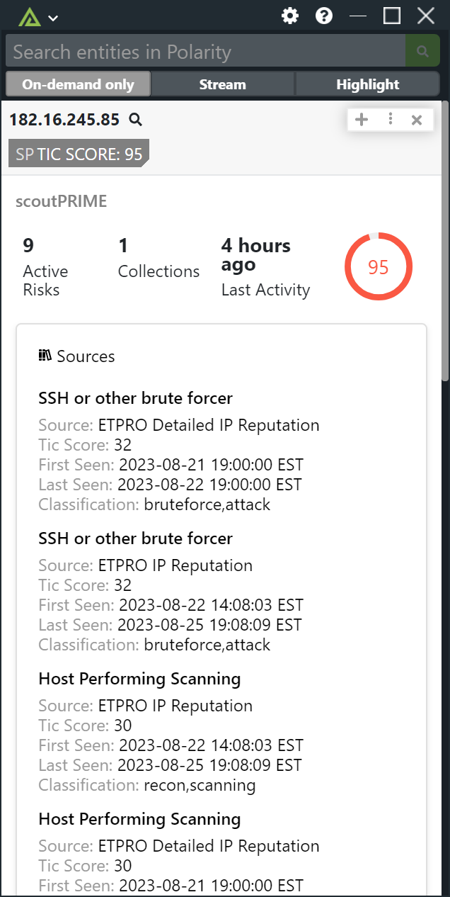

# Polarity scoutPRIME Integration

Search the Lookingglass scoutPRIME and display information including TIC Score, Sources, Collections, WHOIS, and Location data for IPv4 addresses and domains. 

## scoutPRIME Integration Options

### scoutPRIME URL

The base URL for the ScoutPrime API to include the schema (https://) and port as needed

### scoutPRIME API Key

ScoutPrime API Key, that can be generated from the ScoutPrime dashboard.

## Installation Instructions

Installation instructions for integrations are provided on the [PolarityIO GitHub Page](https://polarityio.github.io/).

## Polarity

Polarity is a memory-augmentation platform that improves and accelerates analyst decision making. For more information about the Polarity platform please see:

https://polarity.io/
