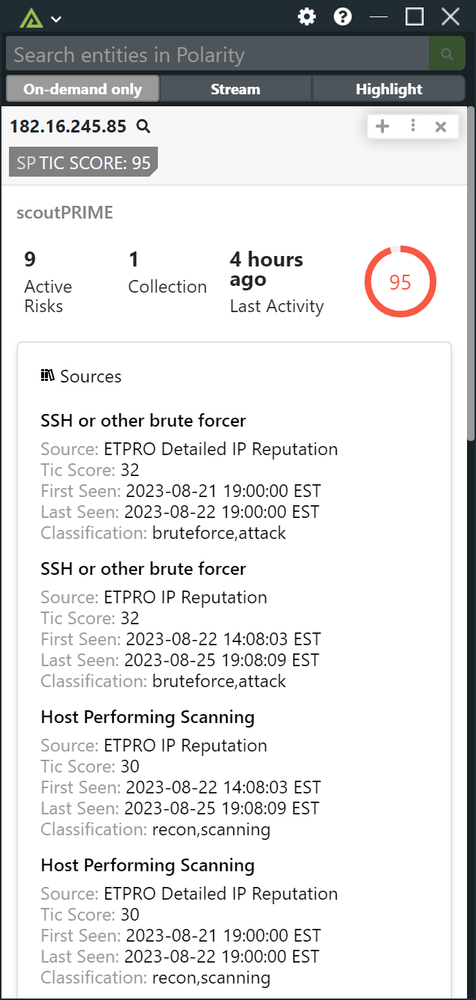

# Polarity scoutPRIME Integration

Search the Lookingglass scoutPRIME and display information including TIC Score, Sources, Collections, WHOIS, and Location data for IPv4 addresses and domains. 

## scoutPRIME Integration Options

### scoutPRIME URL

The base URL for the ScoutPrime API to include the scheme (https://).

### scoutPRIME API Token

ScoutPrime API Token, that can be generated from the ScoutPrime dashboard.

### Search Criteria

Select the search criteria to use when searching scoutPRIME. Only indicators that meet the selected criteria will be returned. Defaults to "All".

Options are:

* All - return all indicators
* Collections Only -- only return indicators that are in a collection
* Active Risks Only -- only return indicators that have active risks
* Collections or Active Risks Only -- only return indicators that are in a collection or have active risks

## Installation Instructions

Installation instructions for integrations are provided on the [PolarityIO GitHub Page](https://polarityio.github.io/).

## Polarity

Polarity is a memory-augmentation platform that improves and accelerates analyst decision making. For more information about the Polarity platform please see:

https://polarity.io/
